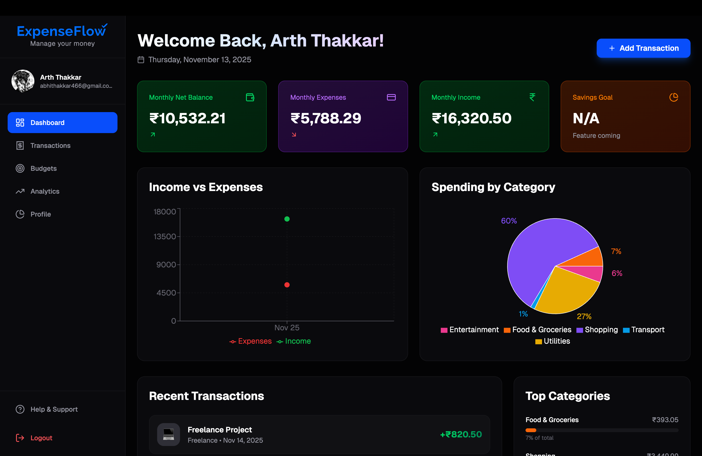
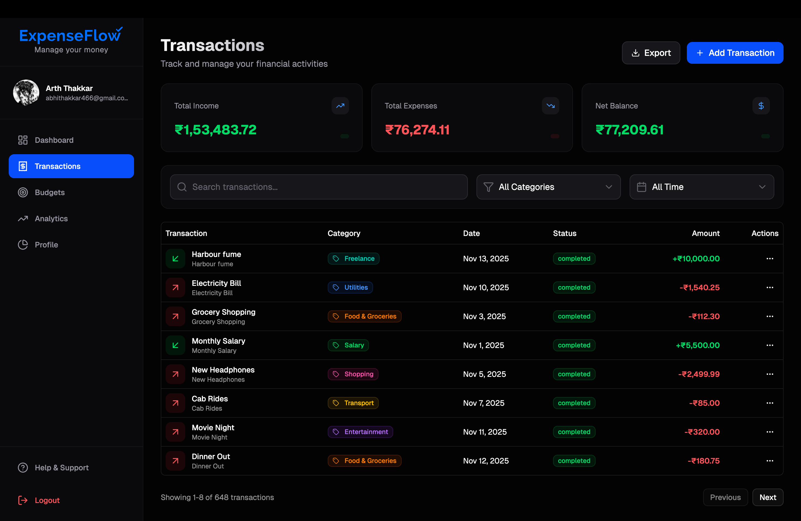
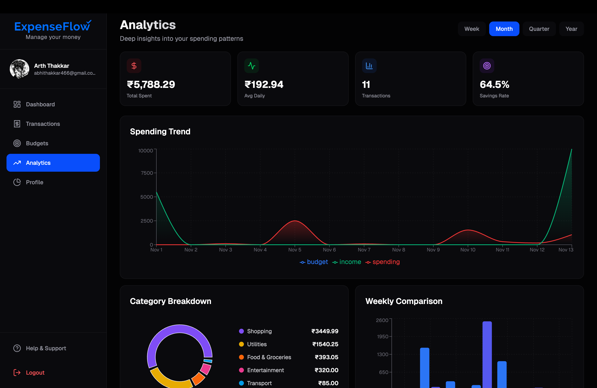

# ExpenseFlow

### Transform Your Financial Chaos Into Clarity

[](https://nextjs.org/)
[](https://supabase.com/)

**A modern, feature-rich expense management platform that empowers individuals and small businesses to take control of their finances through intuitive design, powerful analytics, and real-time insights.**

[📖 Documentation](#-features-that-matter) • [🐛 Report Bug](https://github.com/arththakkar1/expense-flow-web-app/issues) • [✨ Request Feature](https://github.com/arththakkar1/expense-flow-web-app/issues)

---

## 🌟 Why ExpenseFlow?

### 🧠 Intelligent & Intuitive

Smart categorization makes expense tracking effortless with AI-powered insights

### ⚡ Real-Time Sync

Built on Supabase for instant updates across all your devices

### 📊 Data-Driven Decisions

Rich visualizations reveal spending patterns you never knew existed

### 🔒 Privacy First

Secure authentication with bank-level encryption protects your data

---

## ✨ Features That Matter

### 📊 Dashboard

> Your financial command center at a glance

- 💡 Recent spending highlights and trends
- 🎯 Budget health indicators with visual alerts
- ⚡ Quick-access metrics for informed decisions
- 🎨 Customizable widgets for personalized insights

### 💳 Transactions

> Complete control over every expense

- ✏️ **Full CRUD Operations** - Add, edit, delete with ease
- 🔍 **Advanced Filtering** - Search by date, category, amount, or custom tags
- 📑 **Smart Sorting** - Organize by any field—ascending or descending
- 🎯 **Bulk Actions** - Select and manage multiple transactions simultaneously
- 📄 **Seamless Pagination** - Navigate through thousands of entries smoothly

### 💰 Budgets

> Stay on track with intelligent budget management

- 📅 Set monthly, quarterly, or custom period limits
- 🏷️ Category-specific budget allocation
- 📈 Real-time progress tracking with visual indicators
- 🔔 Automated alerts when approaching limits

### 📈 Analysis

> Turn data into actionable insights

- 📊 Interactive spending trend charts
- 🥧 Category breakdown with pie and bar charts
- 📆 Historical comparison (month-over-month, year-over-year)
- 📤 Export-ready reports for deeper analysis

---

## 🛠️ Technology Stack

|         Layer         |      Technology       | Purpose                                         |
| :-------------------: | :-------------------: | :---------------------------------------------- |
|   🎨 **Framework**    |      Next.js 14+      | React framework with SSR/SSG capabilities       |
|    📘 **Language**    |      TypeScript       | Type-safe development with enhanced IDE support |
|    💅 **Styling**     |     Tailwind CSS      | Utility-first CSS for rapid, responsive design  |
|    🗄️ **Backend**     | Supabase (PostgreSQL) | Real-time database with built-in authentication |
| 🔐 **Authentication** |     Supabase Auth     | Secure, scalable user management                |
|  ✅ **Code Quality**  |   ESLint + Prettier   | Consistent, error-free code                     |

---

## 🚀 Quick Start Guide

### Prerequisites

```bash
✓ Node.js (v18 or higher) - Download: https://nodejs.org/
✓ npm or yarn package manager
✓ Supabase account - Sign up: https://supabase.com/
```

### Installation

```bash
# 1️⃣ Clone the repository
git clone https://github.com/arththakkar1/expense-flow-web-app.git
cd expense-flow-web-app

# 2️⃣ Install dependencies
npm install
# or
yarn install

# 3️⃣ Set up environment variables
# Create a .env.local file with your Supabase credentials
cp .env.example .env.local

# 4️⃣ Run the development server
npm run dev
# or
yarn dev

# 5️⃣ Open http://localhost:3000 in your browser 🎉
```

### Environment Variables

Create a `.env.local` file in the root directory:

```env
# Supabase Configuration
NEXT_PUBLIC_SUPABASE_URL=https://your-project-ref.supabase.co
NEXT_PUBLIC_SUPABASE_ANON_KEY=your-anon-key-here
```

> 💡 **Tip:** Find your credentials at Dashboard → Settings → API

---

## 🗄️ Database Setup

### Supabase Schema

Execute the following SQL in your Supabase SQL Editor to set up the database schema:

#### 1. Accounts Table

```sql
CREATE TABLE public.accounts (
  id UUID NOT NULL DEFAULT extensions.uuid_generate_v4(),
  user_id UUID NULL,
  name TEXT NOT NULL,
  current_balance NUMERIC(15, 2) NOT NULL DEFAULT 0.00,
  CONSTRAINT accounts_pkey PRIMARY KEY (id)
) TABLESPACE pg_default;

CREATE INDEX IF NOT EXISTS idx_accounts_user_id
  ON public.accounts USING btree (user_id)
  TABLESPACE pg_default;
```

#### 2. Categories Table

```sql
CREATE TABLE public.categories (
  id UUID NOT NULL DEFAULT extensions.uuid_generate_v4(),
  user_id UUID NULL,
  name TEXT NOT NULL,
  icon TEXT NULL,
  color TEXT NULL,
  type TEXT NOT NULL,
  created_at TIMESTAMP WITH TIME ZONE NULL DEFAULT NOW(),
  CONSTRAINT categories_pkey PRIMARY KEY (id),
  CONSTRAINT categories_user_id_name_type_key UNIQUE (user_id, name, type),
  CONSTRAINT categories_type_check CHECK (
    type = ANY (ARRAY['expense'::TEXT, 'income'::TEXT])
  )
) TABLESPACE pg_default;
```

#### 3. Transactions Table

```sql
CREATE TABLE public.transactions (
  id UUID NOT NULL DEFAULT extensions.uuid_generate_v4(),
  user_id UUID NULL,
  category_id UUID NULL,
  type TEXT NOT NULL,
  amount NUMERIC(15, 2) NOT NULL,
  description TEXT NULL,
  date DATE NOT NULL,
  notes TEXT NULL,
  tags TEXT[] NULL,
  created_at TIMESTAMP WITH TIME ZONE NULL DEFAULT NOW(),
  updated_at TIMESTAMP WITH TIME ZONE NULL DEFAULT NOW(),
  account_id UUID NULL,
  CONSTRAINT transactions_pkey PRIMARY KEY (id),
  CONSTRAINT transactions_account_id_fkey
    FOREIGN KEY (account_id) REFERENCES accounts(id) ON DELETE CASCADE,
  CONSTRAINT transactions_category_id_fkey
    FOREIGN KEY (category_id) REFERENCES categories(id) ON DELETE SET NULL,
  CONSTRAINT transactions_type_check CHECK (
    type = ANY (ARRAY['expense'::TEXT, 'income'::TEXT, 'transfer'::TEXT])
  )
) TABLESPACE pg_default;

CREATE TRIGGER update_account_balance_trigger
  AFTER INSERT OR DELETE OR UPDATE ON transactions
  FOR EACH ROW EXECUTE FUNCTION update_account_balance();

CREATE TRIGGER update_transactions_updated_at
  BEFORE UPDATE ON transactions
  FOR EACH ROW EXECUTE FUNCTION update_updated_at_column();
```

#### 4. Budgets Table

```sql
CREATE TABLE public.budgets (
  id UUID NOT NULL DEFAULT extensions.uuid_generate_v4(),
  user_id UUID NULL,
  category_id UUID NULL,
  amount NUMERIC(15, 2) NOT NULL,
  period TEXT NULL DEFAULT 'monthly'::TEXT,
  start_date DATE NOT NULL,
  end_date DATE NULL,
  is_active BOOLEAN NULL DEFAULT TRUE,
  created_at TIMESTAMP WITH TIME ZONE NULL DEFAULT NOW(),
  updated_at TIMESTAMP WITH TIME ZONE NULL DEFAULT NOW(),
  CONSTRAINT budgets_pkey PRIMARY KEY (id),
  CONSTRAINT budgets_category_id_fkey
    FOREIGN KEY (category_id) REFERENCES categories(id) ON DELETE CASCADE,
  CONSTRAINT budgets_period_check CHECK (
    period = ANY (
      ARRAY['daily'::TEXT, 'weekly'::TEXT, 'monthly'::TEXT, 'yearly'::TEXT]
    )
  )
) TABLESPACE pg_default;

CREATE TRIGGER update_budgets_updated_at
  BEFORE UPDATE ON budgets
  FOR EACH ROW EXECUTE FUNCTION update_updated_at_column();
```

#### 5. Goals Table

```sql
CREATE TABLE public.goals (
  id UUID NOT NULL DEFAULT extensions.uuid_generate_v4(),
  user_id UUID NULL,
  name TEXT NOT NULL,
  target_amount NUMERIC(15, 2) NOT NULL,
  current_amount NUMERIC(15, 2) NULL DEFAULT 0,
  deadline DATE NULL,
  icon TEXT NULL,
  color TEXT NULL,
  is_completed BOOLEAN NULL DEFAULT FALSE,
  created_at TIMESTAMP WITH TIME ZONE NULL DEFAULT NOW(),
  updated_at TIMESTAMP WITH TIME ZONE NULL DEFAULT NOW(),
  CONSTRAINT goals_pkey PRIMARY KEY (id)
) TABLESPACE pg_default;

CREATE TRIGGER update_goals_updated_at
  BEFORE UPDATE ON goals
  FOR EACH ROW EXECUTE FUNCTION update_updated_at_column();
```

#### 6. Profiles Table

```sql
CREATE TABLE public.profiles (
  id UUID NOT NULL,
  user_id UUID NULL,
  username TEXT NULL,
  full_name TEXT NULL,
  avatar_url TEXT NULL,
  created_at TIMESTAMP WITH TIME ZONE NULL DEFAULT NOW(),
  updated_at TIMESTAMP WITH TIME ZONE NULL DEFAULT NOW(),
  email TEXT NULL,
  CONSTRAINT profiles_pkey PRIMARY KEY (id),
  CONSTRAINT profiles_username_key UNIQUE (username),
  CONSTRAINT profiles_user_id_fkey
    FOREIGN KEY (user_id) REFERENCES auth.users(id) ON DELETE CASCADE,
  CONSTRAINT username_length CHECK (CHAR_LENGTH(username) >= 3)
) TABLESPACE pg_default;
```

### Helper Functions

You'll also need to create these helper functions:

```sql
-- Function to update updated_at timestamp
CREATE OR REPLACE FUNCTION update_updated_at_column()
RETURNS TRIGGER AS $$
BEGIN
  NEW.updated_at = NOW();
  RETURN NEW;
END;
$$ LANGUAGE plpgsql;

-- Function to update account balance on transaction changes
CREATE OR REPLACE FUNCTION update_account_balance()
RETURNS TRIGGER AS $$
BEGIN
  IF TG_OP = 'INSERT' THEN
    UPDATE accounts
    SET current_balance = current_balance +
      CASE
        WHEN NEW.type = 'income' THEN NEW.amount
        WHEN NEW.type = 'expense' THEN -NEW.amount
        ELSE 0
      END
    WHERE id = NEW.account_id;
  ELSIF TG_OP = 'UPDATE' THEN
    UPDATE accounts
    SET current_balance = current_balance -
      CASE
        WHEN OLD.type = 'income' THEN OLD.amount
        WHEN OLD.type = 'expense' THEN -OLD.amount
        ELSE 0
      END +
      CASE
        WHEN NEW.type = 'income' THEN NEW.amount
        WHEN NEW.type = 'expense' THEN -NEW.amount
        ELSE 0
      END
    WHERE id = NEW.account_id;
  ELSIF TG_OP = 'DELETE' THEN
    UPDATE accounts
    SET current_balance = current_balance -
      CASE
        WHEN OLD.type = 'income' THEN OLD.amount
        WHEN OLD.type = 'expense' THEN -OLD.amount
        ELSE 0
      END
    WHERE id = OLD.account_id;
  END IF;

  RETURN NEW;
END;
$$ LANGUAGE plpgsql;
```

---

## 📦 Build for Production

```bash
# Create optimized production build
npm run build

# Start production server
npm start
```

---

## 📸 Screenshots

### 🏠 Dashboard

_Get a complete overview of your financial health_


---

### 💳 Transaction Management

_Effortlessly track and manage all your expenses_


---

### 📊 Analytics

_Visualize spending patterns with beautiful charts_


---

## 🤝 Contributing

We love contributions! Here's how you can help:

1. 🍴 Fork the repository
2. 🌿 Create your feature branch (`git checkout -b feature/AmazingFeature`)
3. 💾 Commit your changes (`git commit -m 'Add some AmazingFeature'`)
4. 📤 Push to the branch (`git push origin feature/AmazingFeature`)
5. 🎉 Open a Pull Request

---

## 📄 License

This project is licensed under the **MIT License** - see the [LICENSE](LICENSE.md) file for details.

---

## 🙏 Acknowledgments

- Built with [Next.js](https://nextjs.org/)
- Powered by [Supabase](https://supabase.com/)
- Styled with [Tailwind CSS](https://tailwindcss.com/)
- Icons from [Lucide](https://lucide.dev/)

---

### Made with ❤️ by the ExpenseFlow Team

**[⭐ Star this repo](https://github.com/arththakkar1/expense-flow-web-app)** if you find it helpful!
